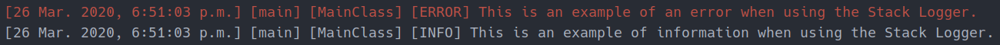

# StackLogger
This Java project improves the usefulness of System.out and System.err print methods by logging the run-time stack.

# Requirements
* Java 8 or newer
* JetBrains IntelliJ 2019.1 or newer (optional)

# How to Install
To use this class, simply import it and put these two lines in your main method:

```
System.setOut(new StackLogger(System.out, "information.txt"));
System.setErr(new StackLogger(System.err, "errors.txt"));
```

If you do not wish to log to a file, simply pass null as the second parameter, like so:

```
System.setOut(new StackLogger(System.out, null));
System.setErr(new StackLogger(System.err, null));
```

You can also run the included Main class for an example of the Stack Logger.

# Example
This is an example of what the output looks like from the included Main class:


